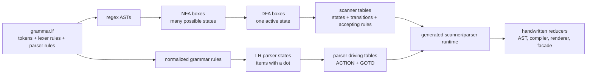
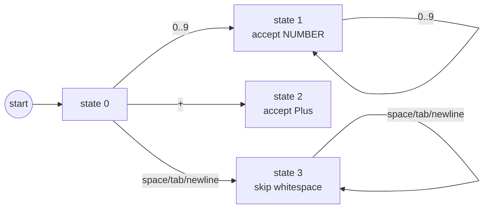
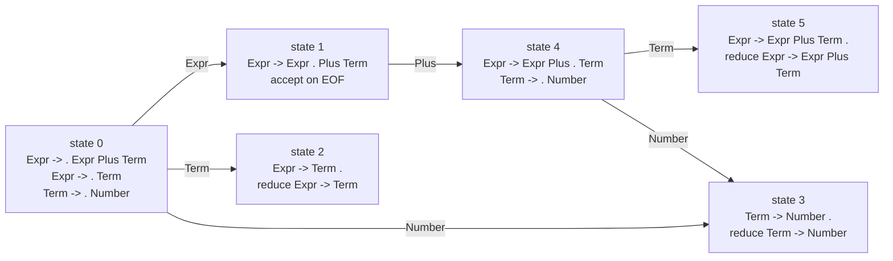
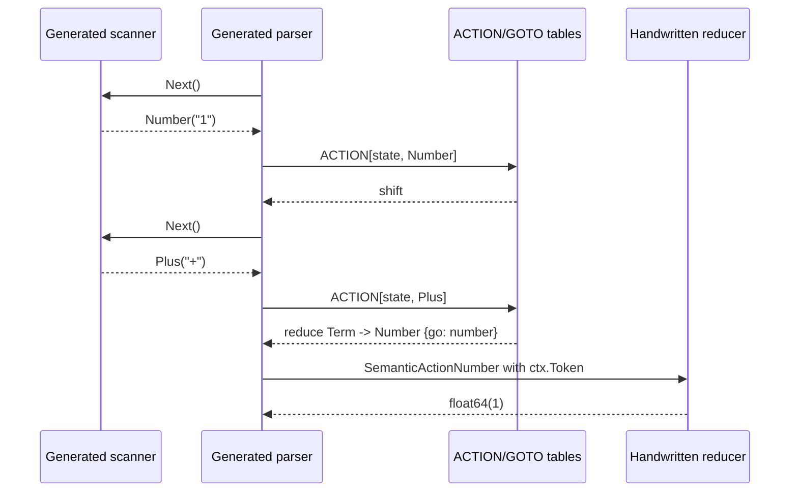

# Automata And Driving Tables

Document id: `lang-forge-automata-and-tables-v1`

Status: `active`

Last updated: `2026-07-11`

Owner: `Project maintainers`

Scope: `Beginner-friendly visual explanation of scanner automata, LR parser states, generated driving tables, and handwritten semantics`

LangForge generates recognizers. A recognizer is mostly two things:

- an automaton, which is a set of states connected by transitions;
- a small runtime loop that consults generated tables to decide the next step.

The tables are not magic. They are compact data versions of the boxes and
arrows that compiler textbooks draw on a whiteboard.

This page uses Mermaid diagrams because GitHub, many Gitea installations, and
VS Code Markdown preview can display them. If a renderer does not support
Mermaid, the fenced source still reads as text.

## Big Picture



Plain text version:

```text
grammar.lf
  -> regex AST -> NFA -> DFA -> scanner tables
  -> grammar rules -> LR states -> ACTION/GOTO parser tables
  -> generated runtime loops
  -> handwritten reducer/facade/domain code
```

## Scanner Automata

The scanner reads characters and returns lexemes. A lexeme is a token plus
source text and source positions, for example `Number("123")`.

A lexer rule such as:

```lf
DIGIT = [0-9];
NUMBER = DIGIT+;

NUMBER => token(Number);
"+"    => token(Plus);
[1-32]+ => skip;
```

first becomes regex syntax trees. Those trees become an NFA, then a DFA.



The generated scanner table is the same diagram as data:

| State | Input range | Next state | Accepting rule |
|---|---:|---:|---|
| `0` | `0..9` | `1` | none |
| `1` | `0..9` | `1` | `NUMBER` |
| `0` | `+` | `2` | none |
| `2` | none | none | `Plus` |
| `0` | whitespace | `3` | none |
| `3` | whitespace | `3` | skip |

At runtime, the scanner keeps one active DFA state and remembers the best
accepting rule it has seen. That gives Lex-style behavior:

1. take the longest match;
2. if two rules match the same length, use the earlier lexer rule;
3. skip hidden/skipped rules and return visible lexemes to the parser.

## Parser Item Boxes

The parser works over grammar rules, not characters. A parser state is a set of
items. An item is a production with a dot showing how much of the right-hand
side has already been recognized.

```text
Expr -> Expr Plus . Term
```

The dot means:

- `Expr Plus` has already been shifted or reduced;
- the parser now expects `Term`.

For this grammar fragment:

```lf
Expr : left=Expr Plus right=Term {go: add}
     | value=Term {go: pass}
     ;
Term : token=Number {go: number}
     ;
```

a simplified LR automaton might look like this:



The parser table is the same automaton as data:

| State | Lookahead or symbol | Table | Entry |
|---:|---|---|---|
| `0` | `Number` | ACTION | shift `3` |
| `0` | `Expr` | GOTO | `1` |
| `0` | `Term` | GOTO | `2` |
| `1` | `Plus` | ACTION | shift `4` |
| `1` | EOF | ACTION | accept |
| `2` | `Plus` or EOF | ACTION | reduce `Expr -> Term` |
| `3` | `Plus` or EOF | ACTION | reduce `Term -> Number` |
| `4` | `Number` | ACTION | shift `3` |
| `4` | `Term` | GOTO | `5` |
| `5` | `Plus` or EOF | ACTION | reduce `Expr -> Expr Plus Term` |

LangForge writes this kind of information into `langforge.tables.json`, and
target backends turn it into target-native arrays, maps, or sorted lookup
tables.

## Parser Runtime Loop

Generated parsers all run the same conceptual loop:

```text
state stack = [0]
value stack = []
lookahead = scanner.Next()

repeat:
    state = top(state stack)
    action = ACTION[state, lookahead]

    if action is shift:
        push action.next_state
        push lookahead lexeme as a semantic value
        lookahead = scanner.Next()

    if action is reduce A -> beta:
        pop len(beta) states
        pop len(beta) semantic values
        call reducer if the rule has an action label
        state = top(state stack)
        push GOTO[state, A]
        push reduced semantic value

    if action is accept:
        return final semantic value
```

That loop is why the generated parser can be small and deterministic. It does
not contain a handwritten recursive function per grammar rule. It is a table
driver.

## Where Reducers Fit

The parser table decides *when* a rule reduces. The handwritten reducer decides
*what that rule means*.



For a grammar rule:

```lf
Expr : left=Expr Plus right=Term {go: add} ;
```

LangForge provides a generated typed context such as:

```go
func(ctx parser.AddReduction) (float64, error) {
    return ctx.Left + ctx.Right, nil
}
```

The table knows the rule and action ID. Your reducer knows arithmetic, AST
construction, code generation, rendering, validation, or whatever the DSL
means in your application.

## How To Inspect The Real Tables

Use `inspect` when a grammar surprises you:

```sh
go run ./cmd/lang-forge inspect \
  --spec examples/go/calc/calc.lf \
  --format text
```

For machine-readable data:

```sh
go run ./cmd/lang-forge inspect \
  --spec examples/go/calc/calc.lf \
  --format json > /tmp/calc.inspect.json
```

Look for:

- scanner DFA state count and accepting rules;
- parser state count;
- `actions` entries for shifts, reduces, and accept;
- `gotos` entries for nonterminal transitions after reductions;
- `rules` for normalized production numbers;
- `conflicts` if validation fails.

For detailed LR algorithm differences, continue with
[Parser Algorithms](parser-algorithms.md).

## Reading Generated Code Without Getting Lost

Generated files are easier to read in this order:

1. Token names: `tokens.go`, `Tokens.g.cs`, `tokens.h`, or `tokens.hpp`.
2. Scanner tables: look for scanner states, transitions, and rule actions.
3. Parser rules: look for normalized rule metadata.
4. Parser ACTION/GOTO tables: this is the LR driving table.
5. Semantic action IDs and typed reducer contexts.
6. Runtime loop: the small table-driven shift/reduce driver.

When learning from examples, start with the `.lf` file and handwritten reducer
first. Generated table files are best read after you understand which grammar
rule you are looking for.
